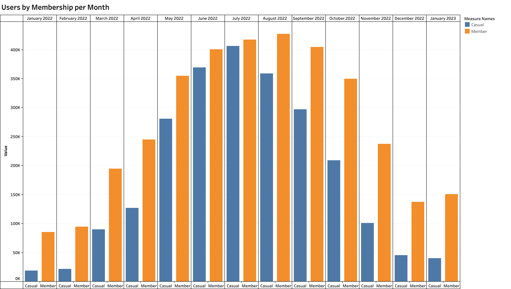
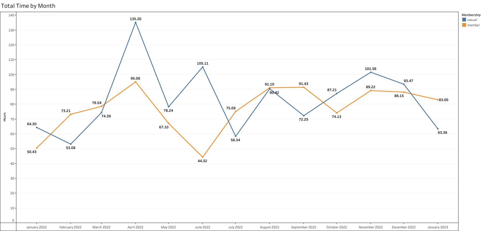

# Case Study: How Does a Bike-Share Navigate Speedy Success?

&nbsp;&nbsp;&nbsp;&nbsp;&nbsp;&nbsp;This is the Google Data Analytics final project. The objective of the capstone is to help Cyclistic, a company of that focus on renting bike and is base in Chicago with a total of 5824 bicycles that are geotracked and locked into a network with 689 stations. 

&nbsp;&nbsp;&nbsp;&nbsp;&nbsp;&nbsp;They have been able to create this ecosystem by using pricing plans that customers must have to use the bikes. The plans that they offer are single-ride passes, full-day passes and annual memberships. Customers that buy one of the first two plans are classified as casual riders and the ones who buy the annual memberships are classified as Cyclistic members.
  
&nbsp;&nbsp;&nbsp;&nbsp;&nbsp;&nbsp;Until now everything has been going economically great for the company, but a study made by Cyclistic finance analysts has uncover that annual members are more profitable than casual riders. With that in mind, the marketing department has set a goal to a marketing strategy to convert casual riders to annual members.

## Objetive
&nbsp;&nbsp;&nbsp;&nbsp;&nbsp;&nbsp;Find how Cyclistic can convert casual riders into annual members using a marketing strategy.

## Questions
1.	How do annual members and casual riders use Cyclistic bikes differently?
2.	Why would casual riders buy Cyclistic annual memberships?
3.	How can Cyclistic use digital media to influence casual riders to become members?

## Tools & Technologies
* Dataset - [Google - Cyclistic](https://divvy-tripdata.s3.amazonaws.com/index.html)
* Database - [MySQL](https://www.mysql.com/)
* MS Office - [Excel](https://www.microsoft.com/en-us/microsoft-365/excel)
* Data Visualization - [Tableau](https://www.tableau.com/)
* Language - [SQL](https://www.mysql.com/)

## Data Analysis Process

1. Collect

    * First thing to do was search for the dataset via the link. The data is from a first party, making them a reliable source. The files are in CSV format and are stored in a S3 Bucket in AWS Cloud.

2. Clean

    * Before I began cleaning the data in Excel, I create a copy of each file in case something bad happen while cleaning. After that, in each new file I began creating a new column called “Ride_Length” which will store the total time of each ride by user. Then, I set each column to their data type because they were in text format and also did some column sorting. After that, I save the file to begin with the analysis stage.

3. Analyze

    * In this step I begin working in the spreadsheet file by finding the Max and Average ride length. Then I created a Pivot Table to see the total ride length membership per day. After that I exported all files to MySQL and create a queries to find the total user by membership per month and the total time ride length by membership per month. Finally, I exported all the result in csv files to begin with the visualization.

4. Visualization

    * In the final step I created a linear graph for Total Time by Membership and a bar graph for Users Memberships. After that I created the dashboard that will show both graph together.

## Conclusion

&nbsp;&nbsp;&nbsp;&nbsp;&nbsp;&nbsp;After doing all the necessary research for this case study, casual members tend to begin using the bikes between Spring and Summer. With that in mind, the strategy should focus on showing the benefit of having an annual membership via the digital media and giving discount for the annual membership to casual riders between April and August. This will increase the odds for a casual rider to get the membership. Finally, the next step is begin talking with the marketing department to start creating strategies for those months.

